# Data Warehouse Optimization

## Table of Contents
- [Data Warehouse Optimization](#data-warehouse-optimization)
  - [Table of Contents](#table-of-contents)
  - [1. Introduction](#1-introduction)
    - [What This Lab Demonstrates](#what-this-lab-demonstrates)
    - [Lab Steps](#lab-steps)
    - [Schemas Used](#schemas-used)
    - [Tables Created](#tables-created)
    - [Lab Options](#lab-options)
  - [2. Prerequisites](#2-prerequisites)
  - [3. Data Overview and Sources](#3-data-overview-and-sources)
    - [Solution Approach](#solution-approach)
    - [Netezza Data Schema](#netezza-data-schema)
  - [4. Expected Outcome](#4-expected-outcome)
  - [5. Lab Steps](#5-lab-steps)
    - [5.1 Check Netezza Data Source](#51-check-netezza-data-source)
    - [5.2 Create New Schema and Tables in watsonx.data](#52-create-new-schema-and-tables-in-watsonxdata)
    - [5.3 Insert Historic Data into watsonx.data](#53-insert-historic-data-into-watsonxdata)
    - [5.4 Review the Data in watsonx.data](#54-review-the-data-in-watsonxdata)
    - [5.5 Run Analytical Queries using the Presto Engine](#55-run-analytical-queries-using-the-presto-engine)
  - [6. Review the Explain Plan](#6-review-the-explain-plan)
  - [7. How to Improve the ETL / Query Design?](#7-how-to-improve-the-etl--query-design)
  - [Key Takeaways](#key-takeaways)
  - [Automation Option](#automation-option)


## 1. Introduction

> Note that the data used in this lab is generated and does not in any way reflect the stock market movement.

### What This Lab Demonstrates

- **Reducing** the operational cost of running the Data Warehouse environment by offloading historical data from Netezza to watsonx.data
- **Cost savings** by replacing expensive Netezza block storage with Cloud Object Storage
- **Unifying** the data in the watsonx.data Open Hybrid Lakehouse for Analytical and AI applications

### Lab Steps

- ✅ Verify Netezza catalog connection
- ✅ Create schema in watsonx.data iceberg catalog
- ✅ Create all required tables (dim_account, dim_stock, dim_exchange, dim_date, fact_transactions)
- ✅ Insert historical data (pre-2025) from Netezza
- ✅ Verify data was inserted correctly

### Schemas Used

- **Input:** `nz_catalog.equity_transactions` (Netezza source data)
- **Input:** `nz_catalog.equity_transactions_ly` (2025 data for federated queries)
- **Output:** `iceberg_data.netezza_offload_<YourName_First3LettersOfSurname>` (new schema created)

### Tables Created

- `dim_account` (account information)
- `dim_stock` (stock symbols and details)
- `dim_exchange` (exchange information)
- `dim_date` (date dimension for pre-2025)
- `fact_transactions` (historical transactions)

## 2. Prerequisites

- ✅ Completed [Getting Started Setup Guide](../Getting_Started/README.md) Sections 1 and 2
- ✅ Access to **watsonx.ai** and **watsonx.data**

## 3. Data Overview and Sources

### Solution Approach

In this lab, historical data from the Netezza Data Warehouse (DW) database, `INVESTMENTS`, and the `equity_transactions` schema will be offloaded into **watsonx.data** `iceberg_data` catalog. The historic data is identified based on the transactions that took place before 2025. By reducing the volume of data in the Netezza DW, the expensive block storage cost is reduced by using the Cloud Object Storage.

2025 data is left in the data warehouse to minimize disruption to the existing applications. We will be using the **Presto** query engine to run federated queries that aggregate data from Netezza and **watsonx.data**.

The whole lab will be executed in **watsonx.data** UI interface in the back-end shared TechZone environment.

### Netezza Data Schema

[Dataset description](./Data-description.md)

Due to the limitations of the lab environment, we will:

1. Run federated **Presto** queries to offload the data from **Netezza** DW.  
2. Use a separate schema `equity_transactions_ly` instead of deleting historic data from the DW, which is a recommended approach in the production environment. 
3. Run federated queries against 2025 data in **Netezza**'s `equity_transactions_ly` schema that holds 2025 year data and historic data in **watsonx.data**.

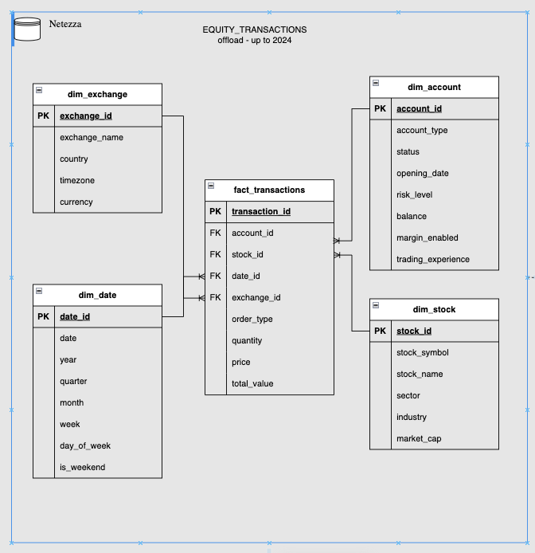


## 4. Expected Outcome

At the end of the lab, you should have:

- **New schema** in `iceberg_data` catalog: `netezza_offload_<YourName_First3LettersOfSurname>`
- **Five tables** with historical data (pre-2025) offloaded from Netezza
- **Ability to run federated queries** combining Netezza 2025 data with watsonx.data historical data
- **Understanding of query execution plans** and optimization opportunities


## 5. Lab Steps

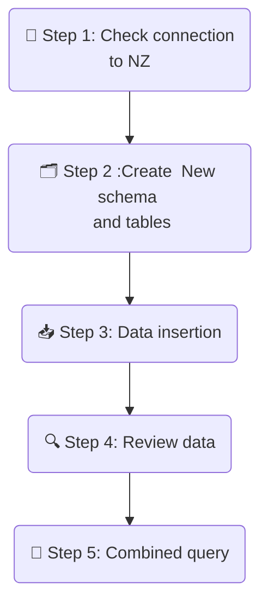

- **Step 1 - Netezza connection**: Check **Netezza** Connection
- **Step 2 - New schema and tables**: Create new schema and tables in the `iceberg_data` catalog for data offload
- **Step 3 - Data insertion**: Insert data into newly created tables from **Netezza** INVESTMENTS schema, for historic transactions before 2025
- **Step 4 - Review data**: Check data samples and number of records in the newly created tables
- **Step 5 - Combined query**: Execute queries that combine the data from the iceberg tables in **watsonx.data** and the 2025 year schema, `equity_transactions_ly` in Netezza

### 5.1 Check Netezza Data Source

1. From [IBM Cloud Resource List](https://cloud.ibm.com/resources) select the **watsonx.data** instance (Under Databases) labeled with `wxdata-`.

2. On the web console hamburger menu in the top left, select `Infrastructure Manager` and verify that **Netezza** is added as a data source.
  
   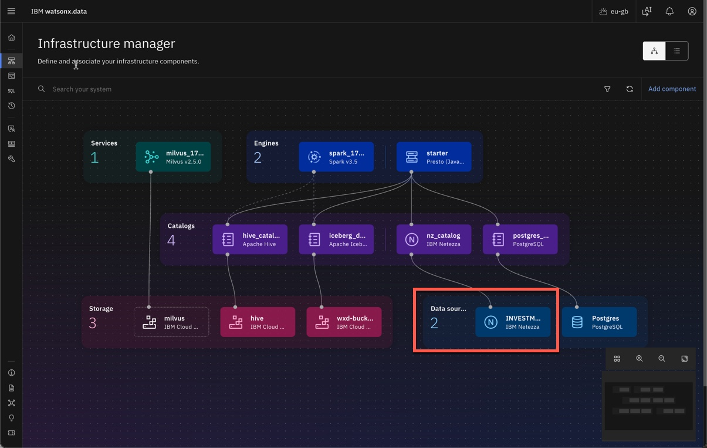
  
3. From the hamburger menu in the top left, select `Data manager`.
   
4. Browse the `nz_catalog` and verify the **Netezza** schemas `equity_transactions` and `equity_transactions_ly` are available.

   

### 5.2 Create New Schema and Tables in watsonx.data

1. From the hamburger menu in the top left, go to `Query workspace`, where you will be executing SQL queries. To run a query, highlight the statement you want to run and select the blue `Run selection on...` button on the top right of the query window.
   
   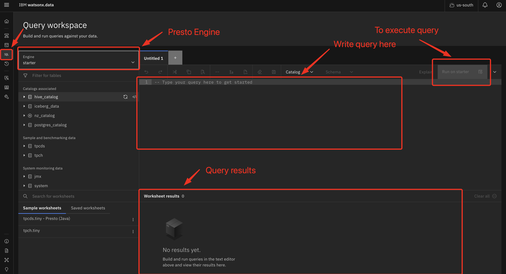

2. Create a schema for **Netezza** offload and tables in **watsonx.data** iceberg catalog where you will offload transaction data from **Netezza** `EQUITY_TRANSACTIONS`. 
  
   Modify the SQL command below, replacing `<WXD_BUCKET>` and `<SCHEMA_DWH_OFFLOAD>` with your values in your `env.txt` file, and paste into the `Query Workspace` (values should be unique across Cloud Account). For the bootcamp, the convention for `SCHEMA_DWH_OFFLOAD` is `netezza_offload_<YourName_First3LettersOfSurname>`

   ```sql
   CREATE SCHEMA IF NOT EXISTS iceberg_data.<SCHEMA_DWH_OFFLOAD> WITH (location = 's3a://<WXD_BUCKET>/<SCHEMA_DWH_OFFLOAD>');
   ```

3. Check that query execution was successful:
   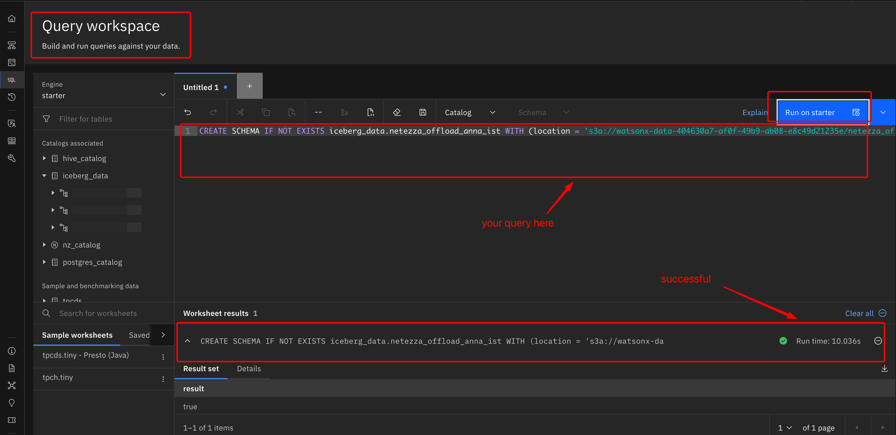

4. Create tables in the newly added schema. Modify the SQL commands below, replacing `<SCHEMA_DWH_OFFLOAD>` with your value, paste commands into the `Query Workspace`, and run them. Be sure to replace it in every statement:
   
    ```sql
    
    -- dim_account
    CREATE TABLE iceberg_data.<SCHEMA_DWH_OFFLOAD>.dim_account (
        account_id INTEGER,
        account_type VARCHAR,
        status VARCHAR,
        opening_date DATE,
        risk_level VARCHAR,
        balance DECIMAL(18, 2),
        margin_enabled BOOLEAN,
        trading_experience VARCHAR
    )
    WITH (
        format = 'PARQUET'
    );
    
    -- dim_stock
    CREATE TABLE iceberg_data.<SCHEMA_DWH_OFFLOAD>.dim_stock (
        stock_id INTEGER,
        stock_symbol VARCHAR,
        stock_name VARCHAR,
        sector VARCHAR,
        industry VARCHAR,
        market_cap DECIMAL(18, 2)
    )
    WITH (
        format = 'PARQUET'
    );
    
    -- dim_exchange
    CREATE TABLE iceberg_data.<SCHEMA_DWH_OFFLOAD>.dim_exchange (
        exchange_id INTEGER,
        exchange_name VARCHAR,
        country VARCHAR,
        timezone VARCHAR,
        currency VARCHAR
    )
    WITH (
        format = 'PARQUET'
    );
    
    -- dim_date
    CREATE TABLE iceberg_data.<SCHEMA_DWH_OFFLOAD>.dim_date (
        date_id INTEGER,
        transaction_date DATE,
        year INTEGER,
        quarter INTEGER,
        month INTEGER,
        week INTEGER,
        day_of_week INTEGER,
        is_weekend BOOLEAN
    )
    WITH (
        format = 'PARQUET'
    );
    
    -- fact_transactions 
    CREATE TABLE iceberg_data.<SCHEMA_DWH_OFFLOAD>.fact_transactions (
        transaction_id INTEGER,
        account_id INTEGER,
        stock_id INTEGER,
        date_id INTEGER,
        exchange_id INTEGER,
        order_type VARCHAR,
        quantity INTEGER,
        price DECIMAL(10,2),
        total_value DECIMAL(18,2)
    )
    WITH (
        format = 'PARQUET'
    );
    ``` 

5. After creating tables, refresh the `iceberg_data` catalog and check that the schema and tables exist in the schema for data offload

   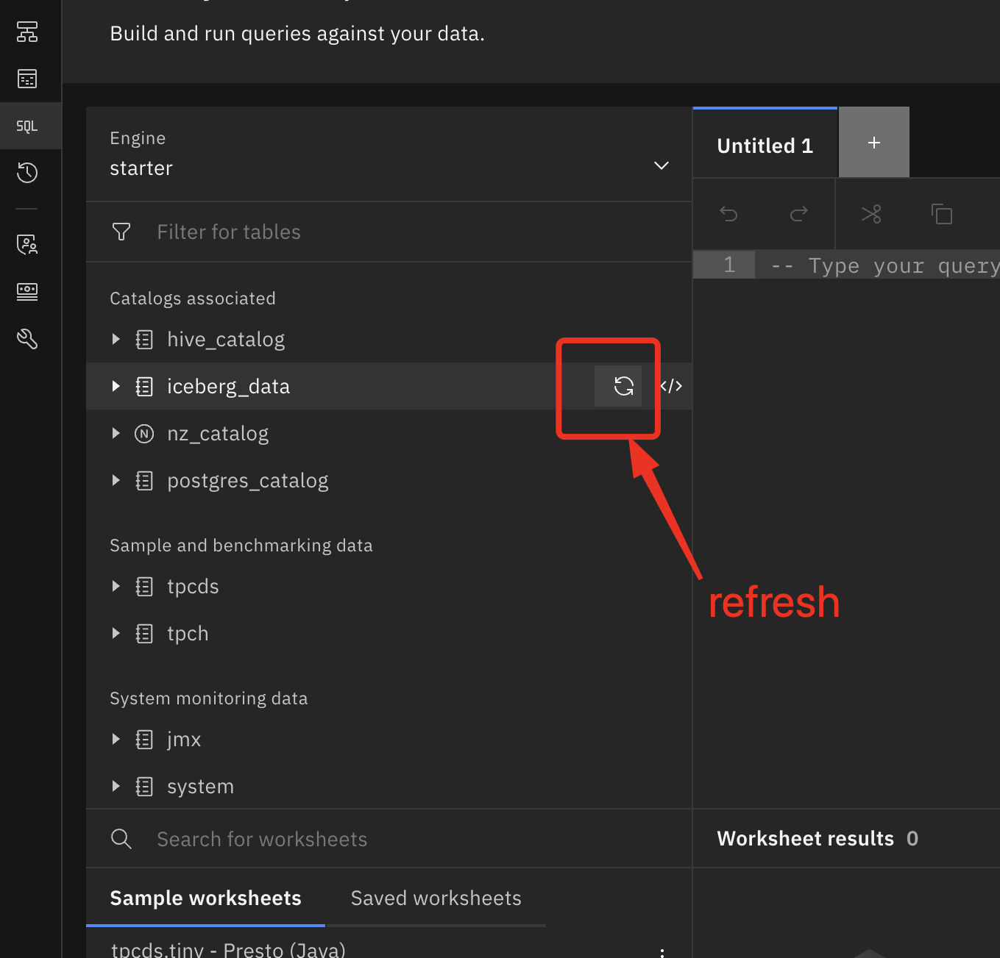<br>
   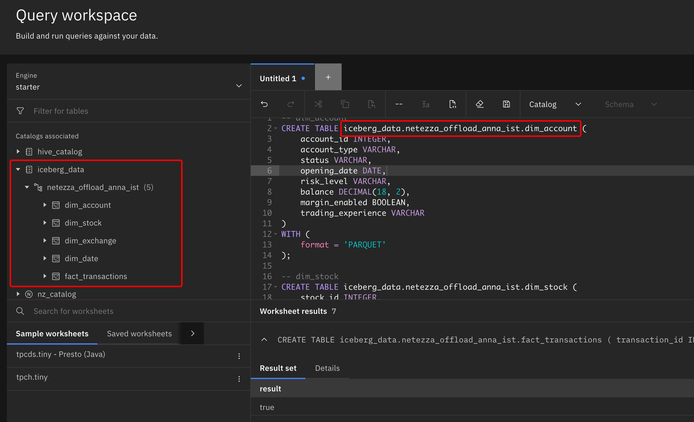

### 5.3 Insert Historic Data into watsonx.data

Insert data into the created tables for **Netezza** filtered by year using a **Presto** federated query. Modify the SQL commands below, replacing `<SCHEMA_DWH_OFFLOAD>` with your value. Paste commands into the `Query Workspace` and run. Be patient, this can take some time.

 ```sql
 -- Insert into dim_date
 INSERT INTO iceberg_data.<SCHEMA_DWH_OFFLOAD>.dim_date
 SELECT *
 FROM nz_catalog.equity_transactions.dim_date dt
 WHERE dt.year < 2025;
 
 -- Insert into fact_transactions (filtered by dim_date)
 INSERT INTO iceberg_data.<SCHEMA_DWH_OFFLOAD>.fact_transactions
 SELECT ft.*
 FROM nz_catalog.equity_transactions.fact_transactions ft
 JOIN iceberg_data.<SCHEMA_DWH_OFFLOAD>.dim_date d ON ft.date_id = d.date_id;
 
 -- Insert into dim_account (using filtered fact_transactions)
 INSERT INTO iceberg_data.<SCHEMA_DWH_OFFLOAD>.dim_account
 SELECT DISTINCT a.*
 FROM nz_catalog.equity_transactions.dim_account a
 JOIN iceberg_data.<SCHEMA_DWH_OFFLOAD>.fact_transactions ft ON a.account_id = ft.account_id;
 
 -- Insert into dim_stock (using filtered fact_transactions)
 INSERT INTO iceberg_data.<SCHEMA_DWH_OFFLOAD>.dim_stock
 SELECT DISTINCT s.*
 FROM nz_catalog.equity_transactions.dim_stock s
 JOIN iceberg_data.<SCHEMA_DWH_OFFLOAD>.fact_transactions ft ON s.stock_id = ft.stock_id;
 
 -- Insert into dim_exchange (using filtered fact_transactions)
 INSERT INTO iceberg_data.<SCHEMA_DWH_OFFLOAD>.dim_exchange
 SELECT DISTINCT e.*
 FROM nz_catalog.equity_transactions.dim_exchange e
 JOIN iceberg_data.<SCHEMA_DWH_OFFLOAD>.fact_transactions ft ON e.exchange_id = ft.exchange_id;
 ```

### 5.4 Review the Data in watsonx.data

You can generate queries to view data samples in some tables. Choose the table, then select the `</>` dropdown menu to the right, and choose `Generate SELECT`. This will create a skeleton `SELECT` statement in the query workspace.

<br>

Or you can paste the following queries directly into the workspace: 

1. Count the number of rows transferred from **Netezza**. Modify the SQL commands below, replacing `<SCHEMA_DWH_OFFLOAD>` with your value. Paste commands into the `Query Workspace` and run.
   
   ```sql
    SELECT 'transactions_count', COUNT(*) AS count
    FROM  "iceberg_data"."<SCHEMA_DWH_OFFLOAD>"."fact_transactions" as ft
    
    UNION
    
    SELECT 'dates_count', COUNT(*) AS count
    FROM "iceberg_data"."<SCHEMA_DWH_OFFLOAD>"."dim_date" as dd
    
    UNION
    
    SELECT 'stock_count', COUNT(*) AS count
    FROM "iceberg_data"."<SCHEMA_DWH_OFFLOAD>"."dim_stock" as ds
    
    UNION
    
    SELECT 'exchanges_count', COUNT(*) AS count
    FROM "iceberg_data"."<SCHEMA_DWH_OFFLOAD>"."dim_exchange" as de
    
    UNION
    
    SELECT 'accounts_count', COUNT(*) AS count
    FROM "iceberg_data"."<SCHEMA_DWH_OFFLOAD>"."dim_account" as da;
   ```
   
   Expected output:
   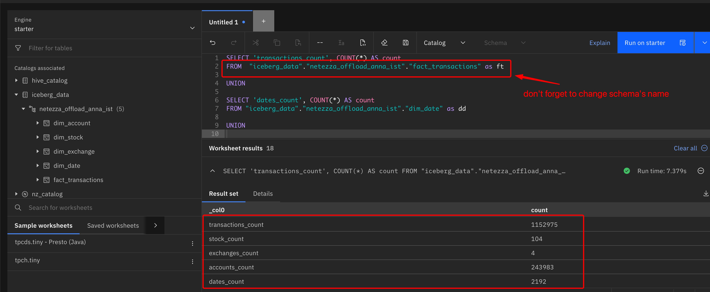

   > NOTE: Due to lab limitations, we will use `equity_transactions_ly`, which contains only 2025 data. The same schema and table definitions are identical to the `equity_transactions` schema we've offloaded in previous steps.

### 5.5 Run Analytical Queries using the Presto Engine

The data has now been prepared and is ready for consumption by business users and data scientists for analytical and AI purposes. Let's develop some queries to answer the business questions listed below.

**Tip:** 

1. Use the `iceberg_data.<SCHEMA_DWH_OFFLOAD>` schema for the historic data and `nz_catalog.equity_transactions_ly` for 2025 data.
2. Make sure you are working from the `Query workspace`.
   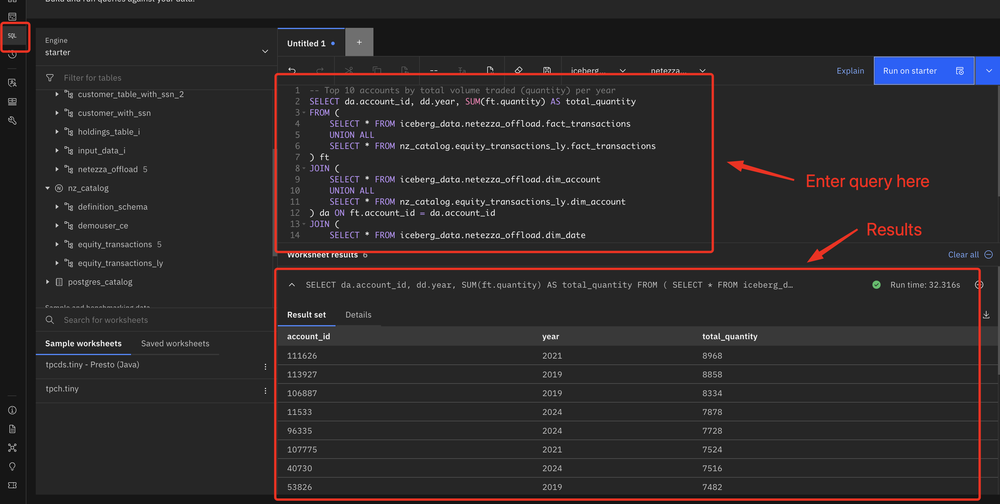

**Questions**:
1. Calculate the top 10 accounts by the volume traded per year.
2. Identify the Top 10 accounts by transaction value per year.
3. Determine the Average transaction price for each of the stocks, including 2025 trades.
4. Determine the Number of transactions that took place in each exchange by year.
5. List all of the stocks traded by `account_id`, 215, during the years 2024 and 2025.

   [**Solution Queries**](./Solution.md)


## 6. Review the Explain Plan

- From the **watsonx.data** left navigation menu select `Query History`.
  
  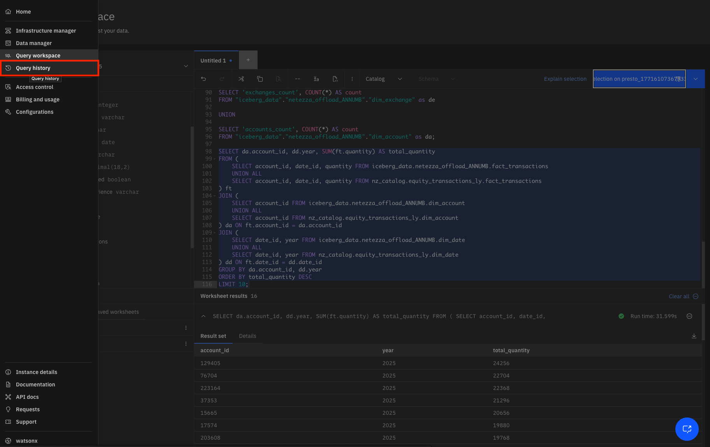

- Select one of the queries that you would like to analyze, click the right 3-dot menu of the query, and select **View Execution Plans**.
  
  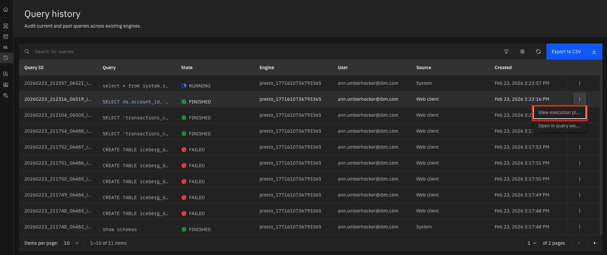

- Review the content in the `Logical Execution plan`, `Distributed execution plan`, and `Explain analyze` tabs of the chosen query. 
  
  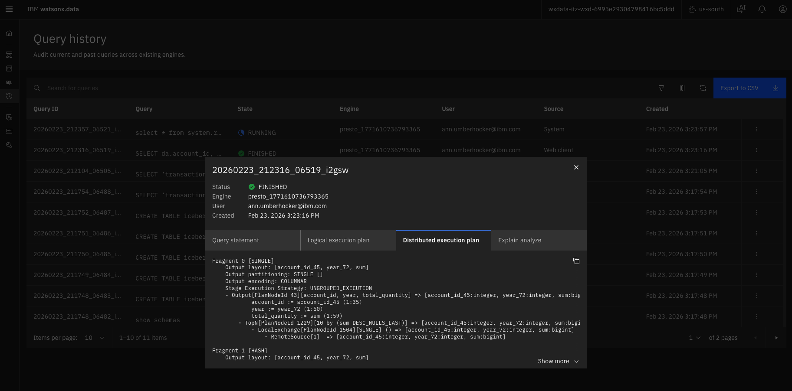


## Key Takeaways

✅ **Cost Optimization:** Reduced Netezza storage costs by offloading historical data to Cloud Object Storage

✅ **Data Federation:** Used Presto to query across Netezza and watsonx.data seamlessly

✅ **Lakehouse Architecture:** Leveraged Iceberg tables for efficient data management

✅ **Query Performance:** Analyzed execution plans to understand query optimization

✅ **Hybrid Approach:** Kept current data in Netezza while archiving historical data in watsonx.data


